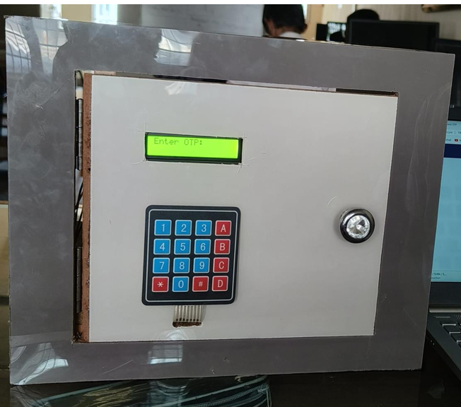
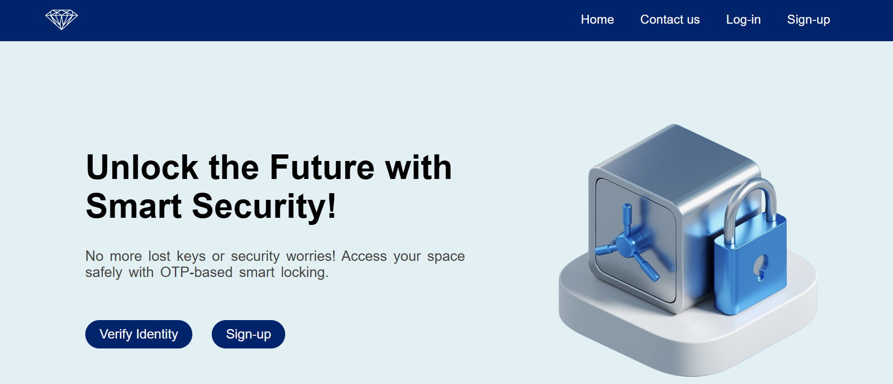
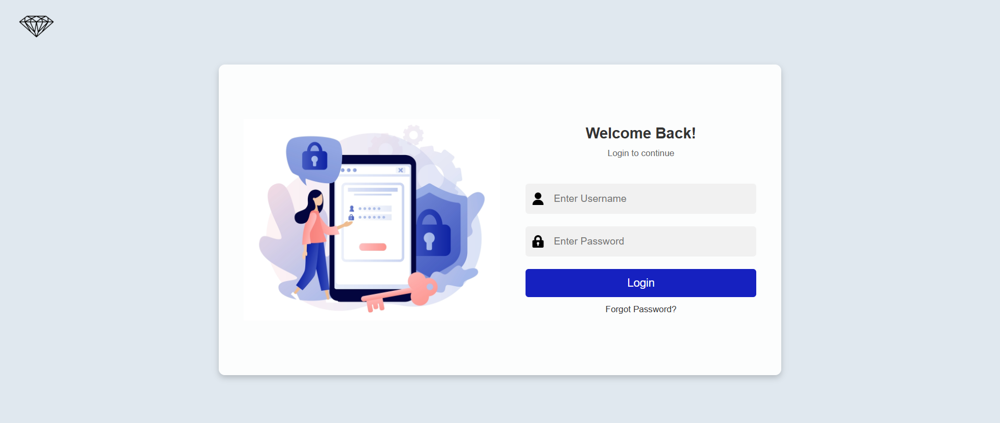
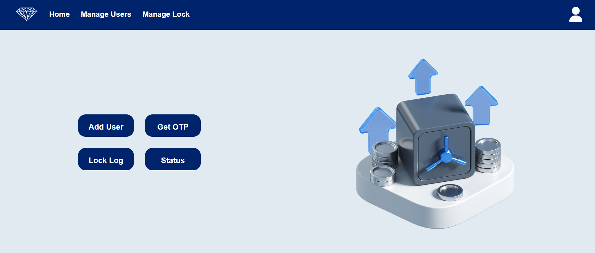
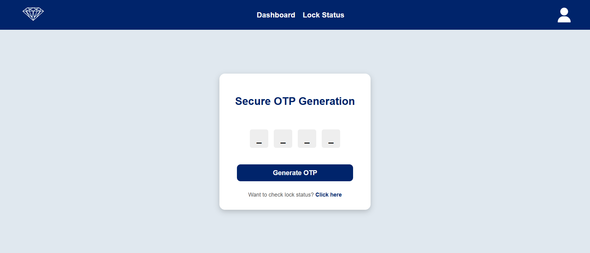
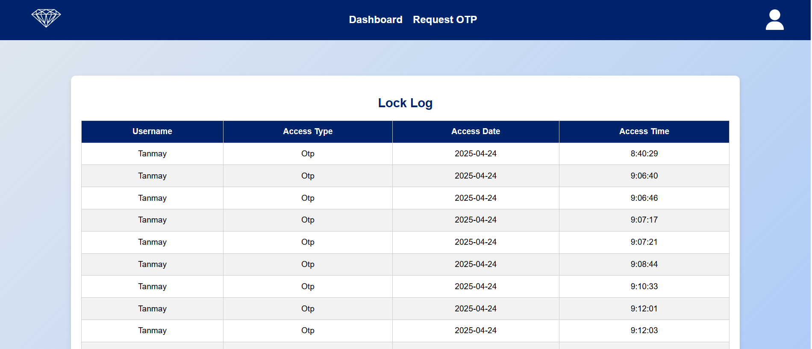
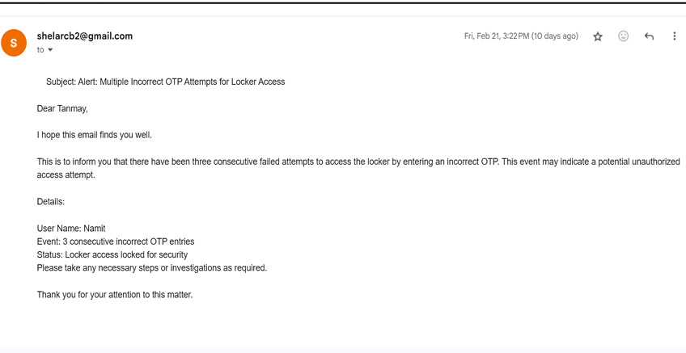

# OTP Based Smart Locker System

A secure and user-friendly smart locker system using **OTP-based access**. Eliminates the need for keys or static passwords, ensuring that only legitimate users can access the locker. Built with **Flask, MySQL**, and a web interface for **admin/user management**.

---

## Problem Statement

Traditional lockers rely on physical keys or static passwords, which can be lost, stolen, or forgotten. Biometric locks are expensive and sometimes insecure. Additionally, there is no way to track unauthorized access attempts.  

This project solves these issues with:
- **OTP-based locker access**
- **Email notifications for unauthorized attempts**
- **Detailed access logs** for audit and monitoring

---

## Key Features

### Locker Prototype
- Access controlled by **One-Time Password (OTP)**.
- **3 wrong OTP attempts** → lock disables for 2 minutes.
- **Admin receives email alerts** on unauthorized access attempts.

### Web Application

**User Features:**
- Request OTP to access the locker.
- Contact admin/support for issues.

**Admin Features:**
- Add, remove, or manage users.
- Generate OTP for locker access.
- Monitor locker status remotely.
- View audit logs of all locker activity.

---

## Workflow

1. **User Request OTP:**  
   - User opens the web app and requests an OTP for locker access.  

2. **OTP Generation:**  
   - System generates a **one-time password** and displays it to the user.  

3. **Enter OTP on Locker:**  
   - User enters the OTP on the locker keypad.  

4. **Verification:**  
   - If OTP matches → locker **unlocks**.  
   - If OTP is incorrect → locker **remains locked**.  
   - After 3 consecutive wrong attempts → locker is disabled for 2 minutes and **admin receives an email alert**.  

> This ensures only authorized users can access the locker while keeping track of all attempts.

---

## Tech Stack

- **Backend:** Python Flask  
- **Frontend:** HTML, CSS, JavaScript  
- **Database:** MySQL  
- **Hardware:** 
  - **ESP32**: Microcontroller to control the locker system  
  - **Servo Motor (SG90)**: Controls the physical lock mechanism  
  - **LCD Display (16x2)**: Displays OTP and status messages  
  - **4x4 Keypad**: User enters the OTP  

**Lock Mechanism:**  
- Locker is physically locked/unlocked using the **servo motor** controlled by ESP32 based on OTP verification  

- **Libraries:** Flask-Login, Flask-SQLAlchemy, smtplib  

---

## Screenshots / Demo

### Product / Locker Prototype

### Home Page

### Login Page

### Admin Dashboard

### Request OTP Page

### Lock Status Monitoring

### Audit Logs

### Admin Email Alert (on 3 wrong OTP attempts)

